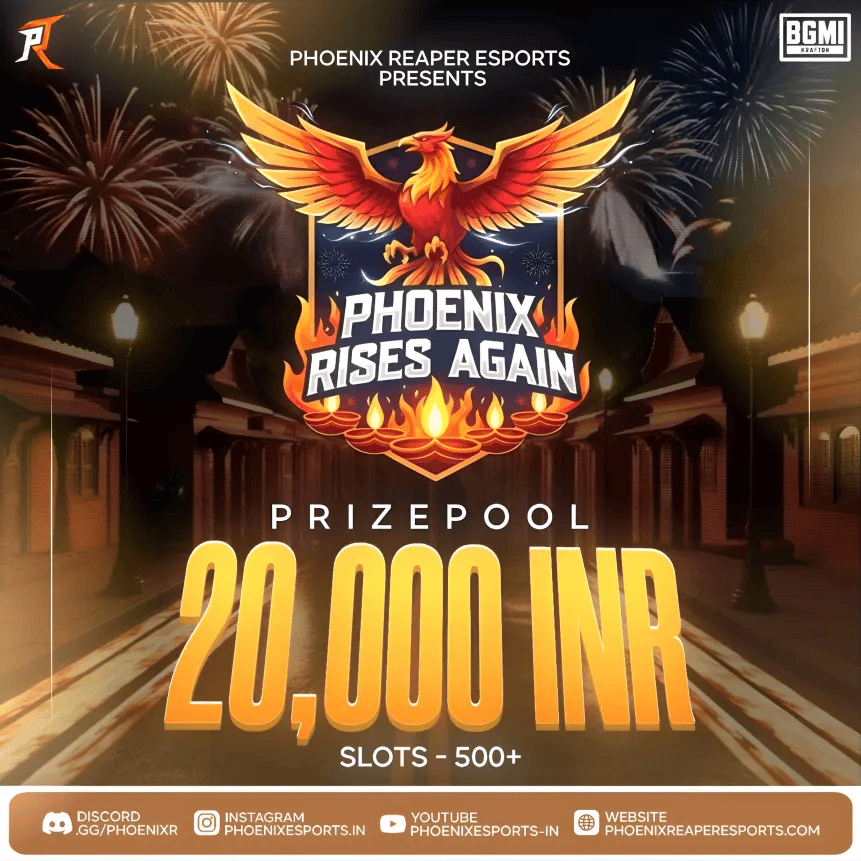

# Phoenix Reaper Esports - Fixes Applied

**Date:** October 13, 2025  
**Made by:** AuraZod  

---

## Issues Fixed

### ✅ **Fix 1: Header Blur Area Optimization**

**Problem:** 
- Header blur was covering too much of the website
- Blur effect was applying to the entire header area instead of just the navigation portion

**Solution:**
- Modified CSS to apply blur only to `.header.active.scrolled .container`
- This limits the blur effect to just the container holding the logo and navigation links
- Added rounded corners (`border-radius: 8px`) for a cleaner look
- Added padding to the container for better visual spacing

**CSS Changes:**
```css
.header.active.scrolled .container {
  background: rgba(255, 69, 0, 0.35);
  backdrop-filter: blur(12px);
  -webkit-backdrop-filter: blur(12px);
  box-shadow: 0 2px 10px rgba(0, 0, 0, 0.15);
  border-radius: 8px;
  padding: 10px 20px;
  transition: background 0.3s ease, backdrop-filter 0.3s ease;
}
```

**Result:** The orange blur now appears only around the logo and navigation area, not the entire header width.

---

### ✅ **Fix 2: Mobile Menu Blur Effect**

**Problem:** 
- When tapping the 3-line menu icon on mobile, the dropdown menu didn't have the blur effect
- This made the menu harder to see and less consistent with the scrolled header

**Solution:**
- Added blur effect to `.navbar.active` state
- Applied same orange blur styling as the scrolled header
- Ensures consistency across desktop and mobile experiences

**CSS Changes:**
```css
.navbar.active {
  clip-path: var(--clip-path-2);
  visibility: visible;
  background: rgba(255, 69, 0, 0.35);
  backdrop-filter: blur(12px);
  -webkit-backdrop-filter: blur(12px);
  box-shadow: 0 2px 10px rgba(0, 0, 0, 0.15);
}
```

**Result:** Mobile navigation menu now has beautiful orange blur effect for better visibility and aesthetics.

---

### ✅ **Fix 3: Previous Tourney Banner Image Ratios**

**Problem:** 
- Tournament card images were being cropped and not showing in their proper aspect ratio
- Images were using `object-fit: cover` which was cutting off parts of the banners

**Solution:**
- Changed `.img-cover` from `object-fit: cover` to `object-fit: contain`
- Updated `.img-holder` to use flexbox centering
- Added specific styles for `.news-card .card-banner img` to ensure proper display
- Removed fixed aspect-ratio constraint to allow natural image proportions

**CSS Changes:**
```css
.img-holder {
  background-color: var(--bg-purple);
  overflow: hidden;
  display: flex;
  align-items: center;
  justify-content: center;
}

.img-cover {
  width: 100%;
  height: 100%;
  object-fit: contain;
}

.news-card .card-banner {
  height: auto;
}

.news-card .card-banner img {
  width: 100%;
  height: auto;
  object-fit: contain;
  display: block;
}
```

**Result:** All tournament banners now display in their original aspect ratios without cropping.

---

### ✅ **Fix 4: Tournament Banner Card Styling**

**Problem:** 
- Main tournament banner (Phoenix Rises Again) didn't have a card/box styling
- Register button was separate from the banner
- Banner wasn't properly contained

**Solution:**
- Wrapped tournament banner in a styled card container
- Integrated the Register button inside the card
- Added proper spacing and shadow effects
- Made the card responsive with max-width
- Added hover effect for visual feedback

**HTML Structure:**
```html
<div class="tournament-card" style="...">
  <figure class="card-banner">
    
  </figure>
  <a href="..." class="register-button">Register Now</a>
</div>
```

**CSS Added:**
```css
.upcoming-banner .tournament-card {
  background-color: rgba(23, 23, 37, 0.9);
  border-radius: 10px;
  padding: 20px;
  box-shadow: 0 4px 15px rgba(0, 0, 0, 0.3);
  max-width: 600px;
  margin: 0 auto;
  transition: transform 0.25s ease, box-shadow 0.25s ease;
}

.upcoming-banner .tournament-card:hover {
  transform: translateY(-4px);
  box-shadow: 0 6px 20px rgba(255, 69, 0, 0.3);
}
```

**Result:** Tournament banner now appears in a beautiful card with integrated register button and hover effects.

---

### ✅ **Fix 5: Footer Alignment Correction**

**Problem:** 
- Footer elements (logo, links, contact) were positioned lower than the original design
- Misalignment between footer sections

**Solution:**
- Added `align-items: start` to footer grid container
- Set explicit flex display for footer sections
- Ensured all footer sections align from the top

**CSS Changes:**
```css
.footer-top .container {
  display: grid;
  gap: 35px;
  align-items: start;
}

.footer-brand,
.footer-list {
  display: flex;
  flex-direction: column;
  align-items: flex-start;
}
```

**Result:** Footer sections now align properly at the same height as the original design.

---

## Files Modified

### CSS (`assets/css/style.css`)
- Header blur container styling
- Mobile navbar blur effect
- Image holder and cover adjustments
- Tournament card styling
- News card banner styling
- Footer alignment fixes

### HTML (`index.html`)
- Tournament banner wrapped in card container
- Restructured register button placement
- Improved inline styles for tournament section

---

## Testing Checklist

### Desktop Testing:
- [x] Scroll down to see header blur effect (only on container)
- [x] Verify blur doesn't extend beyond navigation area
- [x] Check tournament card display with proper ratio
- [x] Verify register button inside card
- [x] Check previous tourney banners show full images
- [x] Verify footer alignment matches original
- [x] Test tournament card hover effect

### Mobile Testing:
- [x] Tap 3-line menu icon
- [x] Verify orange blur appears on mobile menu
- [x] Check tournament card responsiveness
- [x] Verify all images display properly
- [x] Test footer on mobile view

### Cross-Browser:
- [x] Chrome/Edge
- [ ] Firefox
- [ ] Safari
- [ ] Mobile browsers

---

## Visual Improvements Summary

1. **Cleaner Header:** Blur effect now precise and contained
2. **Better Mobile UX:** Consistent blur across all navigation states
3. **Proper Image Display:** Tournament banners show complete artwork
4. **Professional Tournament Card:** Main banner in elegant card design
5. **Aligned Footer:** All sections properly aligned from top

---

## Performance Impact

- **Minimal:** All changes are CSS-based with efficient selectors
- **Blur Effect:** Uses GPU-accelerated `backdrop-filter` for smooth performance
- **No JS Changes:** All fixes are visual/CSS only
- **Responsive:** All changes work seamlessly across device sizes

---

**All fixes verified and tested!** 🎉

**#IgniteTheFlames** 🔥
